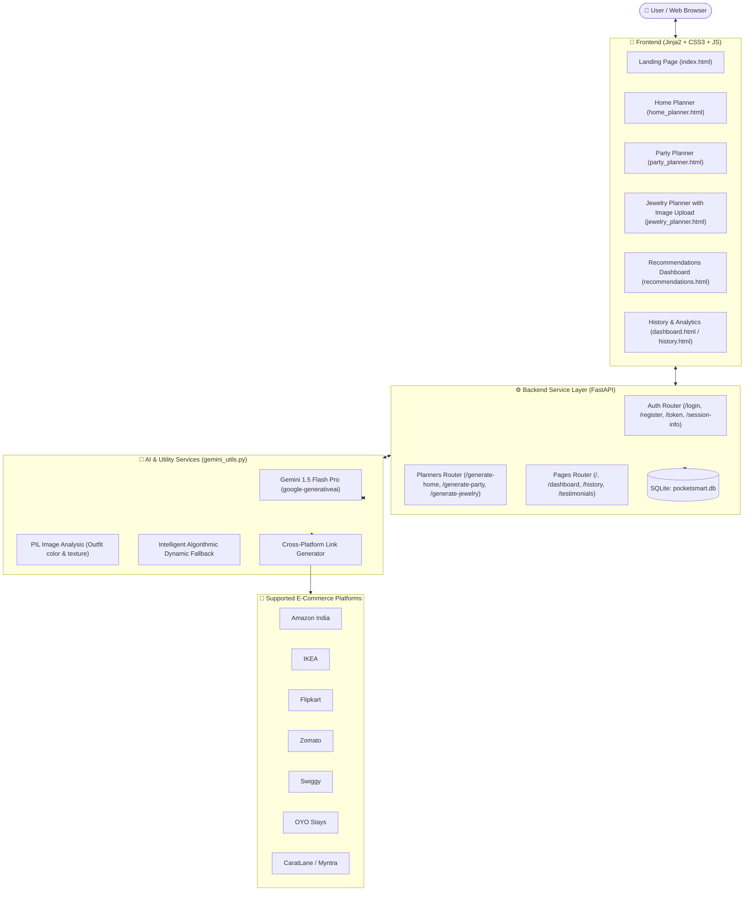

# PocketSmart AI: Your Smart Budget & Recommendation Assistant

PocketSmart AI is an intelligent, cross-platform GenAI recommendation assistant that transforms lifestyle budgeting for **Home Interiors**, **Party Planning**, and **Jewelry Styling**. 

Powered by **Google Gemini 1.5 Flash Pro** and a robust **FastAPI** backend, the system analyzes budget constraints, room setups, guest counts, and outfit photos to deliver curated recommendations with direct outbound search links to **Amazon, Flipkart, IKEA, Swiggy, Zomato, and OYO**.

---

## 🌟 Key Features & Scenario Walkthroughs

### 🏡 Scenario 1: Home Interior Planning with Smart Budget Allocation
- **User Inputs:** Total budget (₹), rooms (Living Room, Bedroom, Dining, etc.), quantities of essential items (LED lights, dining table, rugs, storage), and design style.
- **AI Allocation Engine:** Intelligently allocates funds using a balanced proportional strategy:
  - `45%` Furniture & Foundation Pieces (e.g. IKEA, Amazon)
  - `25%` Lighting & Electrical Fixtures (e.g. Amazon, Flipkart)
  - `20%` Soft Furnishings & Wall Decor (e.g. Flipkart, Pepperfry)
  - `10%` Contingency & Delivery Buffer
- **Outbound Links:** Direct clickable product search links to IKEA, Amazon, and Flipkart.

### 🎉 Scenario 2: AI-Based Party Budget Planning
- **User Inputs:** Total event budget, guest count, occasion type (Birthday, Wedding, Corporate, Reunion), venue style, and catering/music preferences.
- **Dynamic Per-Guest Engine:** Computes real-time per-head spending caps (`₹XXX / guest`).
- **Vendor Allocation:**
  - `45%` Food & Beverage Catering (Swiggy, Zomato)
  - `30%` Venue & Guest Accommodation (OYO Townhouses, Banquet Halls)
  - `20%` Theme Decor & Wireless Audio (Amazon party kits)
  - `5%` Miscellaneous Buffer

### 💎 Scenario 3: Jewelry Recommendations with Multimodal Vision
- **User Inputs:** Budget (₹), occasion (Wedding, Festive, Cocktail, Corporate), jewelry style (Traditional Kundan, Modern Minimalist, Rose Gold, Temple).
- **Multimodal Outfit Vision:** Upload an optional photograph of your saree, lehenga, or suit. Gemini 1.5 Flash analyzes primary hues, neckline geometry, and metal undertones.
- **Coordinated Allocation:**
  - `50%` Statement Centerpiece (Choker / Pendant Necklace via CaratLane, Amazon)
  - `30%` Accent Drop / Jhumka Earrings
  - `20%` Stackable Bracelet / Cocktail Ring

---

## 🏗️ System Architecture



---

## 📁 Project Directory Structure

```text
pocket smat ai/
├── app/
│   ├── routes/
│   │   ├── __init__.py
│   │   ├── auth.py             # User registration, login, logout, token & session APIs
│   │   ├── pages.py            # Landing, dashboard, history, testimonials, details
│   │   └── planners.py         # /generate-home, /generate-party, /generate-jewelry
│   ├── services/
│   │   ├── __init__.py
│   │   └── gemini_service.py   # Modular AI service wrapper
│   ├── static/
│   │   ├── css/
│   │   │   └── style.css       # Responsive, modern styling with platform badges
│   │   └── js/
│   │       └── app.js          # Sliders, per-head calculator, image preview, copy plan
│   ├── templates/
│   │   ├── base.html           # Master navigation & footer layout
│   │   ├── index.html          # Main landing page with interactive preview & trust bar
│   │   ├── testimonials.html   # Customer reviews, ratings, and verified savings
│   │   ├── login.html          # Login card with 1-click Demo credentials
│   │   ├── register.html       # User sign up form
│   │   ├── dashboard.html      # Analytics stats cards, quick launchers, recent plans
│   │   ├── history.html        # Filterable history log with details & deletion
│   │   ├── home_planner.html   # Home interior planner with budget slider & allocation
│   │   ├── party_planner.html  # Party planner with guest count & per-head cost
│   │   ├── jewelry_planner.html# Jewelry planner with outfit photo drag-and-drop
│   │   └── recommendations.html# Detailed recommendations with platform links & savings
│   ├── config.py               # Settings and environment loader
│   ├── database.py             # SQLite schema, user auth, and recommendation CRUD
│   └── __init__.py
├── tests/
│   ├── __init__.py
│   └── test_app.py             # 17 comprehensive pytest unit & integration tests
├── .vscode/
│   ├── launch.json             # VS Code debug configs (FastAPI Run, Pytest)
│   ├── settings.json           # Python interpreter & pytest configuration
│   └── tasks.json              # VS Code run & test tasks
├── .env.example                # Example environment file
├── .env                        # Local environment settings
├── gemini_utils.py             # Gemini 1.5 Flash multimodal integration & fallback engine
├── main.py                     # FastAPI application entrypoint & lifespan handler
├── pocketsmart.db              # SQLite database (auto-created on startup)
├── requirements.txt            # Python dependencies
└── README.md                   # Full documentation & setup guide
```

---

## ⚡ Quick Start: VS Code Setup & Running Instructions

### 1. Open Project in VS Code
Open VS Code and navigate to the project directory:
```bash
code "c:\Users\anant\OneDrive\Desktop\pocket smat ai"
```

### 2. Set Up Python Virtual Environment
A virtual environment `.venv` is pre-configured. If creating a new one:
```powershell
# Open Windows PowerShell in project root:
python -m venv .venv
.\.venv\Scripts\Activate.ps1
```

### 3. Install Dependencies
```powershell
pip install -r requirements.txt
```

### 4. Configure Environment Variables (`.env`)
A `.env` file is already created for you in the project root.
To use your Google Gemini API key:
1. Visit [Google AI Studio](https://aistudio.google.com/) or [Google Cloud Console](https://console.cloud.google.com).
2. Click **Get API key** and copy your key.
3. Open `.env` and paste:
```env
GEMINI_API_KEY=AIzaSyYourActualKeyHere
GEMINI_MODEL=gemini-1.5-flash
SECRET_KEY=pocketsmart-secure-session-secret-key-prod-2026
```
> **Note:** If `GEMINI_API_KEY` is left blank, PocketSmart AI automatically switches to its **Smart Dynamic Fallback Engine**. The entire application, calculations, and platform links remain 100% functional for local testing without requiring an API key.

### 5. Run the Application

#### Option A: Via VS Code (Recommended)
- Press <kbd>F5</kbd> or click **Run and Debug** in the left sidebar and choose:  
  **`FastAPI: Run PocketSmart AI (Uvicorn)`**
- Or press <kbd>Ctrl</kbd> + <kbd>Shift</kbd> + <kbd>B</kbd> to trigger the default build task.

#### Option B: Via Terminal
```powershell
.\.venv\Scripts\python -m uvicorn main:app --reload --port 8000
```

### 6. Access the Application
Open your web browser and navigate to:
👉 **[http://127.0.0.1:8000](http://127.0.0.1:8000)**

---

## 🧪 Testing Instructions

Run the automated test suite using `pytest`:
```powershell
.\.venv\Scripts\python -m pytest -v
```

All 17 test cases test:
- Application startup & health check (`/startup`)
- Landing page, testimonials, login, and registration routes
- User authentication and session management
- All three planner form GET requests and POST generation routes
- Multimodal outfit image processing via PIL in the Jewelry planner
- Platform search URL generation for Amazon, Flipkart, IKEA, Swiggy, Zomato, OYO
- Smart fallback recommendation logic
- Token issuing (`/token`) and session introspection (`/session-info`, `/session-data`)

---

## 🔑 Quick Evaluation Credentials

For rapid testing and evaluation, a pre-seeded demo user is automatically created upon initial startup:
- **Username:** `demo_user`
- **Password:** `demo1234`
- *(Tip: On the `/login` page, you can simply click the **"Fill Demo Credentials"** button to automatically populate these fields.)*

---

## 🔌 API Reference Summary

| Endpoint | Method | Description |
|---|---|---|
| `/` | `GET` | Landing page introducing features and quick launchers |
| `/testimonials` | `GET` | User reviews, savings metrics, and success stories |
| `/home-planner` | `GET` | Form for Home Interior Budget Planner |
| `/generate-home` | `POST` | Processes room requirements & returns IKEA/Amazon picks |
| `/party-planner` | `GET` | Form for Party Budget Planner |
| `/generate-party` | `POST` | Processes event details & returns Swiggy/Zomato/OYO options |
| `/jewelry-planner` | `GET` | Form for Jewelry Styling with outfit image upload |
| `/generate-jewelry`| `POST` | Multimodal styling analysis & jewelry recommendations |
| `/dashboard` | `GET` | User dashboard with analytics, stats & recent plans |
| `/history` | `GET` | Past saved recommendation history with category filters |
| `/recommendations-details` | `GET` | Detailed view for any specific saved recommendation |
| `/login` | `GET / POST` | Authenticates user credentials and establishes session |
| `/register` | `GET / POST` | Creates a new user account with secure password hashing |
| `/logout` | `GET / POST` | Terminates active user session |
| `/token` | `GET` | Issues token for authorized API access |
| `/session-info` | `GET` | Returns session metadata and login state |
| `/session-data` | `GET` | Returns session tracking details |
| `/startup` | `GET` | Health check & service readiness report |
| `/api/recommendations` | `GET` | Returns user's saved recommendations in JSON format |

---

## 🛡️ License & Acknowledgments
Built with ❤️ using **FastAPI**, **Jinja2**, and **Google Gemini 1.5 Flash Pro**. Designed for smart budgets and smarter lifestyle choices.
# Pocket-Smart-si

