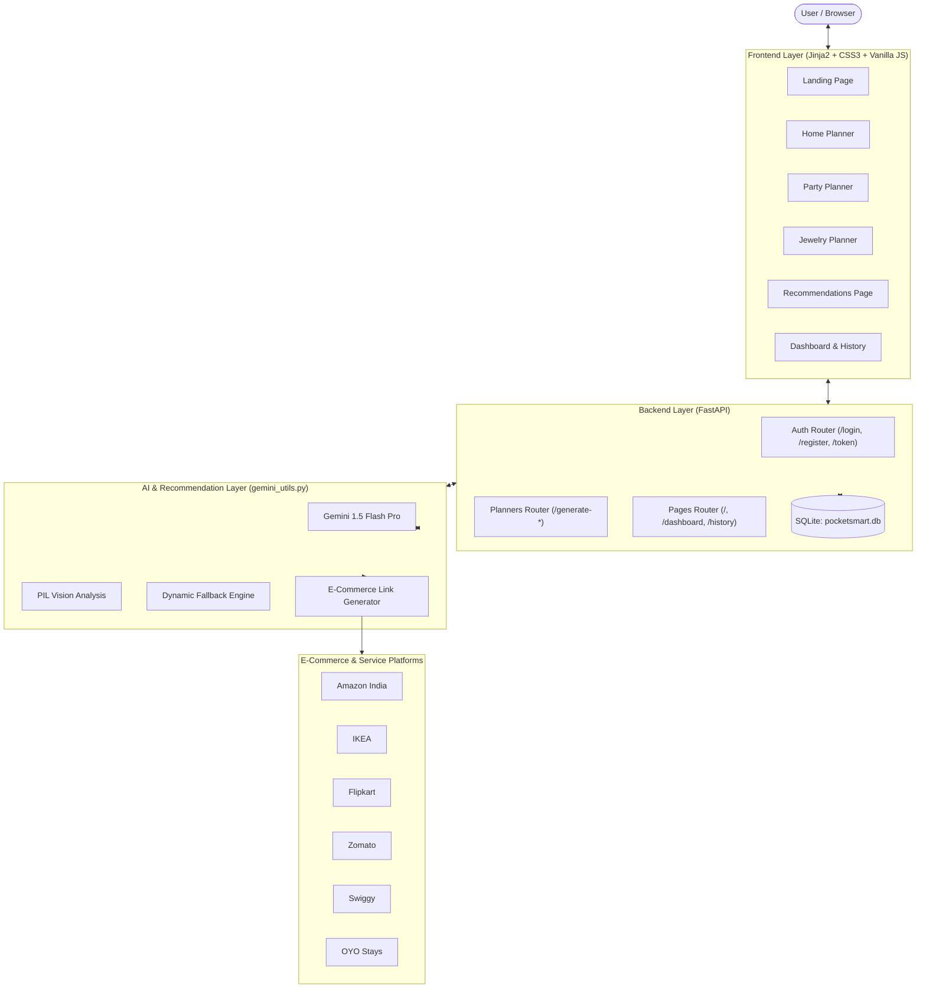

# 💳 PocketSmart AI: Smart Budget & Recommendation Assistant


**PocketSmart AI** is a cross-platform GenAI lifestyle recommendation assistant that bridges everyday budgeting across **Home Interiors**, **Party Planning**, and **Jewelry Styling**.

Powered by **Google Gemini 1.5 Flash Pro** and a lightweight **FastAPI** backend, the platform evaluates user budgets, room dimensions, guest counts, and outfit photos to generate curated, proportional recommendations with direct outbound search links to **Amazon, Flipkart, IKEA, Swiggy, Zomato, and OYO**.

---

## 📌 Table of Contents

- [Key Features & Scenarios](#-key-features--scenarios)
  - [Scenario 1: Home Interior Planning](#1--home-interior-planning)
  - [Scenario 2: AI-Based Party Budget Planning](#2--ai-based-party-budget-planning)
  - [Scenario 3: Jewelry Recommendations with Multimodal Vision](#3--jewelry-recommendations-with-multimodal-vision)
- [System Architecture](#-system-architecture)
- [Project Directory Structure](#-project-directory-structure)
- [Quick Start: Installation & Setup](#-quick-start-installation--setup)
- [Running the Application](#-running-the-application)
- [Automated Testing](#-automated-testing)
- [API Reference](#-api-reference)
- [Evaluation Credentials](#-evaluation-credentials)

---

## 🌟 Key Features & Scenarios

### 1. 🏡 Home Interior Planning
*Smart 45 / 25 / 20 / 10 Proportional Budget Allocation*

- **Inputs:** Total budget (₹), room types (Living Room, Bedroom, Kitchen, Dining), item quantities (LED spotlights, ceiling fans, dining tables, rugs), and aesthetic style.
- **Budget Allocation Strategy:**
  - **45%** Furniture & Foundation Pieces (*IKEA, Amazon*)
  - **25%** Lighting & Electrical Fixtures (*Amazon, Flipkart*)
  - **20%** Soft Furnishings & Wall Decor (*Flipkart, Pepperfry*)
  - **10%** Contingency & Delivery Buffer
- **Platform Links:** Clickable search queries linking directly to matching products on IKEA and Amazon.

---

### 2. 🎉 AI-Based Party Budget Planning
*Per-Guest Cost Optimization & Sourcing*

- **Inputs:** Total event budget (₹), guest count, occasion type (Birthday, Wedding, Corporate, Reunion), venue style, and catering preferences.
- **Dynamic Calculation:** Live JavaScript engine calculates per-head spend (`₹XXX / guest`) to prevent over-ordering.
- **Vendor Allocation:**
  - **45%** Food & Beverage Catering (*Swiggy, Zomato*)
  - **30%** Venue & Guest Accommodations (*OYO Townhouses, Banquet Halls*)
  - **20%** Theme Decor & Audio Equipment (*Amazon*)
  - **5%** Miscellaneous Reserve

---

### 3. 💎 Jewelry Recommendations with Multimodal Vision
*Outfit Aesthetics & Color Coordination*

- **Inputs:** Budget (₹), occasion (Wedding, Festive, Cocktail, Gala), style (Traditional Kundan, Modern Minimalist, Rose Gold, Temple).
- **Multimodal AI Vision:** Upload an optional photograph of your attire. Gemini 1.5 Flash analyzes fabric hues, embroidery metals (gold/silver/rose-gold), and neckline geometry.
- **Coordinated Distribution:**
  - **50%** Statement Centerpiece (*CaratLane, Amazon*)
  - **30%** Accent Earrings
  - **20%** Stackable Bracelet / Cocktail Ring

---

## 🏗️ System Architecture



---

## 📁 Project Directory Structure

```text
PocketSmart-Ai/
├── app/
│   ├── routes/
│   │   ├── __init__.py
│   │   ├── auth.py              # User registration, login, logout, token & session APIs
│   │   ├── pages.py             # Landing, dashboard, history, testimonials, details
│   │   └── planners.py          # /generate-home, /generate-party, /generate-jewelry
│   ├── services/
│   │   ├── __init__.py
│   │   └── gemini_service.py    # Modular AI service wrapper
│   ├── static/
│   │   ├── css/
│   │   │   └── style.css        # Responsive styling with platform brand themes
│   │   └── js/
│   │       └── app.js           # Sliders, image preview, calculations, copy plan
│   ├── templates/
│   │   ├── base.html            # Master layout with responsive navbar & footer
│   │   ├── index.html           # Landing page with interactive preview & partner bar
│   │   ├── testimonials.html    # Verified customer stories & savings metrics
│   │   ├── login.html           # Login page with 1-click Demo credentials
│   │   ├── register.html        # Account creation form
│   │   ├── dashboard.html       # Analytics counters, quick launchers, recent plans
│   │   ├── history.html         # Saved plans log with category filtering
│   │   ├── home_planner.html    # Home interior planner form
│   │   ├── party_planner.html   # Party budget planner form
│   │   ├── jewelry_planner.html # Jewelry planner with photo upload dropzone
│   │   └── recommendations.html # Curated recommendations with platform search links
│   ├── config.py                # Environment and configuration settings
│   ├── database.py              # SQLite schema, user auth, and recommendation CRUD
│   └── __init__.py
├── tests/
│   ├── __init__.py
│   └── test_app.py              # 17 comprehensive pytest unit & integration tests
├── .vscode/
│   ├── launch.json              # VS Code debug launcher (FastAPI Run, Pytest)
│   ├── settings.json            # VS Code Python environment & test runner settings
│   └── tasks.json               # VS Code build and run tasks
├── .env.example                 # Example configuration template
├── .env                         # Local environment configuration
├── gemini_utils.py              # Gemini 1.5 Flash multimodal integration & fallback engine
├── main.py                      # FastAPI application entrypoint with lifespan handler
├── pocketsmart.db               # SQLite database (auto-initialized on startup)
├── requirements.txt             # Python project dependencies
└── README.md                    # Project documentation
```

---

## ⚡ Quick Start: Installation & Setup

### 1. Clone the Repository
```bash
git clone git@github.com:ananthika-commits/PocketSmart-Ai.git
cd PocketSmart-Ai
```

### 2. Create and Activate Virtual Environment
- **Windows (PowerShell):**
  ```powershell
  python -m venv .venv
  .\.venv\Scripts\Activate.ps1
  ```
- **macOS / Linux:**
  ```bash
  python3 -m venv .venv
  source .venv/bin/activate
  ```

### 3. Install Dependencies
```bash
pip install -r requirements.txt
```

### 4. Configure Environment Variables
Copy `.env.example` to `.env`:
```powershell
copy .env.example .env
```
Inside `.env`, configure your settings:
```env
SECRET_KEY=pocketsmart-secure-session-secret-key-prod-2026
DATABASE_URL=sqlite:///./pocketsmart.db
GEMINI_API_KEY=
GEMINI_MODEL=gemini-1.5-flash
HOST=0.0.0.0
PORT=8000
DEBUG=True
```
> **Note on Gemini API Key:** You can generate a free Gemini API key from [Google AI Studio](https://aistudio.google.com/). If left empty, PocketSmart AI automatically runs using its **Smart Algorithmic Fallback Engine**, ensuring full local functionality without an API key.

---

## 🚀 Running the Application

### Option A: Using VS Code
- Open the project folder in VS Code (`code .`).
- Press <kbd>F5</kbd> or choose **Run > Start Debugging** (`FastAPI: Run PocketSmart AI (Uvicorn)`).

### Option B: Using Terminal
```powershell
uvicorn main:app --reload --port 8000
```

Once started, open your browser at:
👉 **`http://127.0.0.1:8000`**

---

## 🧪 Automated Testing

PocketSmart AI includes an end-to-end test suite covering routes, multimodal inputs, authentication, and fallback logic:
```powershell
pytest -v
```

**Results:** `17 passed in ~3.5s`

---

## 🔌 API Reference

| Endpoint | Method | Description |
|:---|:---|:---|
| `/` | `GET` | Landing page introducing features and quick launchers |
| `/testimonials` | `GET` | User reviews, savings metrics, and success stories |
| `/home-planner` | `GET` | Form for Home Interior Budget Planner |
| `/generate-home` | `POST` | Processes room requirements & returns IKEA/Amazon picks |
| `/party-planner` | `GET` | Form for Party Budget Planner |
| `/generate-party` | `POST` | Processes event details & returns Swiggy/Zomato/OYO options |
| `/jewelry-planner` | `GET` | Form for Jewelry Styling with outfit image upload |
| `/generate-jewelry`| `POST` | Multimodal styling analysis & jewelry recommendations |
| `/dashboard` | `GET` | User dashboard with analytics, stats & recent plans |
| `/history` | `GET` | Past saved recommendation history with category filters |
| `/recommendations-details` | `GET` | Detailed view for any specific saved recommendation |
| `/login` | `GET / POST` | Authenticates user credentials and establishes session |
| `/register` | `GET / POST` | Creates a new user account with secure password hashing |
| `/logout` | `GET / POST` | Terminates active user session |
| `/token` | `GET` | Issues token for authorized API access |
| `/session-info` | `GET` | Returns session metadata and login state |
| `/session-data` | `GET` | Returns session tracking details |
| `/startup` | `GET` | Health check & service readiness report |
| `/api/recommendations` | `GET` | Returns user's saved recommendations in JSON format |

---

## 🔑 Evaluation Credentials

For testing and demonstration, a pre-seeded user is created automatically:
- **Username:** `demo_user`
- **Password:** `demo1234`
- *(On the `/login` page, you can click the **"Fill Demo Credentials"** button to auto-populate these values.)*

---

## 📄 License
This project is open-source and licensed under the [MIT License](LICENSE).